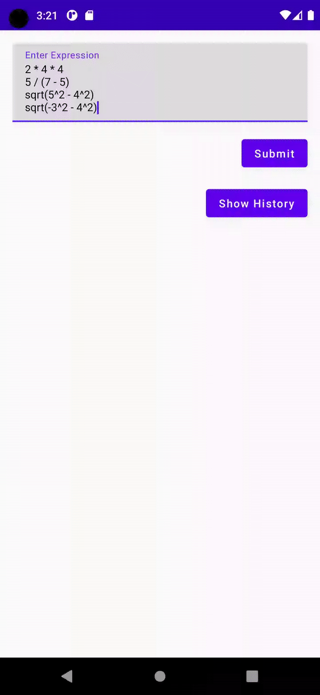
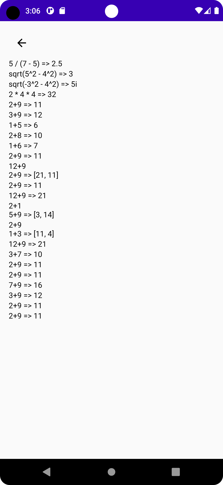

# Online Sales AI Assignment

An Android application for evaluating mathematical expressions and storing history.

## Features

- Evaluate mathematical expressions.
- Store and view expression evaluation history.

## Technologies Used

- **Retrofit and Moshi**: Employed for making HTTP POST requests to the math expression evaluation API and moshi for json parsing.
- **Dagger/Hilt for Dependency Injection**: Integrated for dependency injection, ensuring a modular and maintainable codebase.
- **Room Database**: Used for local data storage of history items, adhering to best practices for SQLite integration.
- **Coroutines**: Write asynchronous code in a sequential manner.
- **Mockito and Robolectric**: Ensure code correctness through unit tests.
- **Jetpack Compose**:  Utilized for the UI, providing an efficient and declarative way to create user interfaces.
- **ViewModel**: Retains data across configuration changes, reducing the risk of data loss during rotation or other lifecycle events.


## Expression Evaluation API

**Endpoint:** POST `https://api.mathjs.org/v4/`

**Headers:** `content-type: application/json`

**Request Body:**
```json
  {
  "expr": [
    "a = 1.2*(2 + 4.5)",
    "a / 2",
    "5.08 cm in inch",
    "sin(45 deg) ^ 2",
    "9 / 3 + 2i",
    "b = [-1, 2; 3, 1]",
    "det(b)"
  ],
  "precision": 14
}

```

**Response:**
```json
{
  "result": [
    "7.8",
    "3.9",
    "2 inch",
    "0.5",
    "3 + 2i",
    "[[-1, 2], [3, 1]]",
    "-7"
  ],
  "error": null
}
```

**Response Description:**

| Name   | Type                   | Description                                                                                      |
|--------|------------------------|--------------------------------------------------------------------------------------------------|
| result | string, string[], null | On success, contains evaluated result as a string or array of strings for each expression.       |
| error  | string, null           | On failure, contains an error message. On success, it's null.                                    |


## Folder Structure

```
app/
|-- src/
|   |-- main/
|   |   |-- java/
|   |   |   |-- com/
|   |   |       |-- ajit/onlinesalesaiassignment/
|   |   |           |-- data/
|   |   |   |           |-- api/
|   |   |   |              |-- ExpressionApiService
|   |   |   |           |-- database/
|   |   |   |              |-- Dao/
|   |   |   |                 |-- HistoryDao
|   |   |   |              |-- AppDatabase
|   |   |   |           |-- model/
|   |   |   |              |-- ApiResponse
|   |   |   |              |-- ExpressionRequest
|   |   |   |              |-- HistoryItem
|   |   |   |           |-- repository/
|   |   |   |              |-- ExpressionRepository
|   |   |           |-- di/
|   |   |   |           |-- AppModule
|   |   |   |           |-- DatabaseModule
|   |   |   |           |-- ViewModelModule
|   |   |           |-- ui/
|   |   |   |           |-- navigation/
|   |   |   |              |-- Destinations
|   |   |   |              |-- MainNavGraph
|   |   |   |           |-- screens/
|   |   |   |              |-- HistoryTab/
|   |   |   |              |-- MainScreen/
|   |   |   |           |-- viewmodel/
|   |   |   |              |-- ExpressionViewModel/
|   |   |           |-- utils/
|   |   |   |              |-- UiState
|   |   |   |-- res/
|   |   |       |-- values/
|   |   |       |-- layout/
|-- build.gradle
|-- androidManifest.xml
```

## Setup and Build

1. Clone the repository.
2. Open the project in Android Studio.
3. Build and run the app on an emulator or device.

## Testing

1. Unit tests: Utilize Mockito and Robolectric for testing.
2. Code Coverage: Please set Jacoco as Coverage runner to get coverage report

#### Note : Please remember this while checking tests
```
1. I have achieved 100% code coverage for repository and viewmodel.

2. If you want to test Dao then run HistoryDao seperately and see the results in coverage report.
   It may not show code coverage as Roboelectric tests are not shown in Jacoco code coverage report.
```

## Screenshots

#### Main Screen
  

#### History Screen
  


## Contributing

Contributions are welcome! If you find any issues or have ideas to improve the app, feel free to create a pull request or open an issue.